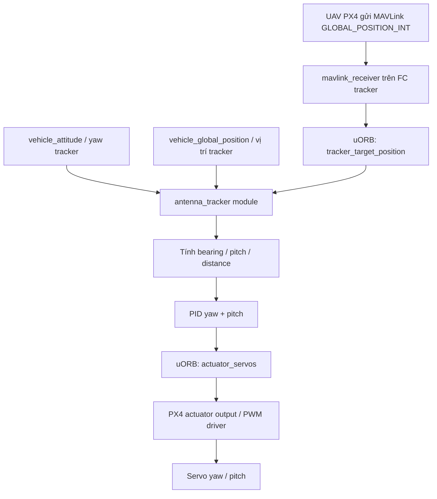

# OVERVIEW.md — PX4 Antenna Tracker Native Firmware

## 1. Mục tiêu dự án

Dự án này hướng tới việc **custom firmware PX4 v1.17.0** để biến một flight controller riêng thành **FC Antenna Tracker**.

FC tracker sẽ:

1. Nhận thông tin vị trí UAV qua MAVLink.
2. Đọc attitude/yaw thực tế của cụm antenna từ AHRS trên chính FC tracker.
3. Tính toán:
   - bearing/yaw target,
   - pitch/elevation target,
   - horizontal distance,
   - trạng thái mất target.
4. Chạy PID yaw/pitch.
5. Xuất lệnh servo yaw/pitch qua pipeline actuator/PWM của PX4.

Hướng này là **PX4-native airframe + PX4-native module**. Mục tiêu là tạo firmware tương tự ArduPilot AntennaTracker nhưng chạy trong kiến trúc PX4.

---

## 2. Phạm vi hiện tại

### In scope

- PX4-Autopilot tag: `v1.17.0`
- Ngôn ngữ chính: C++
- FC tracker chạy firmware PX4 custom
- Tạo airframe mới: `antenna_tracker`
- Tạo module mới: `src/modules/antenna_tracker/`
- Tạo uORB message riêng cho target UAV
- Sửa `mavlink_receiver` để lấy `GLOBAL_POSITION_INT` từ UAV mục tiêu
- Tính toán bearing/pitch/distance
- PID yaw/pitch
- Xuất servo bằng `actuator_servos`
- Test trước bằng SITL/mô phỏng rồi mới test phần cứng

### Out of scope ở giai đoạn đầu

- Không dùng Gimbal v2 làm hướng chính
- Không port toàn bộ ArduPilot AntennaTracker ngay từ đầu
- Không hỗ trợ đầy đủ tất cả mode ngay giai đoạn đầu
- Continuous rotation chỉ dùng closed-loop attitude→rate cơ bản; chưa hỗ trợ
  đếm vòng hoặc tự quản lý cable-wrap
- Không tối ưu scan/reacquire target trước khi basic tracking ổn định

---

## 3. Kiến trúc tổng quát



---

## 4. Môi trường phát triển

### Firmware base

```bash
PX4_Autopilot v1.17.0
```

### Target firmware

- PX4 v1.17.0
- Custom branch: `antenna_tracker_v1.17`
- Build target tùy board:
  - SITL build: `make px4_sitl`
  - SITL boot đúng tracker: `PX4_SYS_AUTOSTART=4099 PX4_SIM_MODEL=none PX4_PARAM_SIH_VEHICLE_TYPE=5 ./bin/px4`
  - Hardware ví dụ: `make px4_fmu-v6x_default`
  - Board custom của dự án có thể cần target riêng tùy cấu trúc hiện tại.

Lưu ý: không dùng `make px4_sitl gz_x500` để kiểm tra airframe tracker, vì model `gz_x500` ép `SYS_AUTOSTART=4001` và QGC sẽ hiển thị quadcopter.

### Trạng thái MicoAir H743 trước FIELD-001 (2026-07-19)

- Firmware `micoair_h743_antenna_tracker` hiện tại đã build, nạp, verify và
  reboot thành công; artifact SHA-256 là
  `00f70dd6a9fae553bb4d3c4904e45e33df2f47510586f45a343c7f24f43726a4`.
- PX4 báo `ready_to_arm=true`; ARM/DISARM chuẩn qua MAVLink/QGC protocol đều
  nhận ACK result 0. `TRK_MODE=AUTO` chỉ trở thành effective sau ARM; khi thiếu
  global position, tracker giữ park 1500/1500 us với reason sensor-invalid.
- BENCH-001 và đường target USB HW-001 đã pass bằng số liệu.
- Đổi MAIN1/MAIN2 từ PWM 400 Hz sang 50 Hz đã sửa pitch park: residual giảm còn
  0,020°. Người vận hành xác nhận đầu yaw positional đã hồi đúng dấu cơ khí;
  residual attitude 25,740° dù output về 1500 µs vì vậy được chuyển sang lỗi
  heading/compass, không còn là bằng chứng servo kẹt. BENCH-003 mới đo selected
  compass device 527625 tăng từ 0,412 G lên 1,887 G (4,58 lần) khi yaw chuyển
  động và EKF báo magnetic field disturbed. Retest giới hạn 1486..1514 µs sau
  đó pass với field đổi -2,52%, yaw span 1,736° và không có EKF fault, nhưng
  staged retest tiếp theo đã định vị ngưỡng: 1452..1548 µs / 8,039° pass với
  field đổi -1,08%, còn 1400..1600 µs / 17,009° fail với field đổi -16,61% và
  tái hiện residual yaw 25,03° sau neutral. BENCH-003 vẫn blocked; HW-002,
  HW-003 và FIELD-001 chưa được phép chạy.
- Sau khi người vận hành calibration lại compass, Stage 1 1452..1548 µs được
  chạy lại với ngưỡng dừng 10%. Selected field device 527625 giảm từ 0,30380 G
  xuống 0,18921 G (-37,72%) và sau STOP vẫn chỉ 0,19241 G (-36,66%); reported
  yaw còn residual 55,70° tại output 1500/1500 µs. Stage 2 đã được bỏ qua theo
  ngưỡng an toàn. Calibration đơn thuần chưa sửa được nhiễu từ của installation.
- Comparison tiếp theo đã chọn mag nội IST8310 device 396817
  (`CAL_MAG0_PRIO=100`, `CAL_MAG1_PRIO=0`) và reboot để EKF khởi tạo sạch.
  Cùng Stage 1, selected field giảm từ 0,31948 G xuống 0,26669 G (-16,52%),
  sau neutral vẫn -16,66% và reported yaw residual 32,97°. Mag nội tốt hơn mag
  ngoài nhưng vẫn fail ngưỡng 10%; priority mag nội hiện được giữ lại, còn
  BENCH-003/HW-002/HW-003/FIELD-001 tiếp tục blocked.
- Lần lặp mới nhất với priority hiện tại MAG0=75/MAG1=50 vẫn chọn mag nội.
  80 mẫu trong phần đầu/mid sweep rất sạch (+0,23%), nhưng ngay sau STOP field
  giảm -25,62%; sau 15 giây neutral vẫn -25,16% và yaw residual 38,71°.
  Như vậy lỗi còn lớn và xuất hiện ở phần travel/return muộn, không phải offset
  dòng servo cố định trong toàn bộ sweep.
- Sau đó priority được đặt rõ MAG0=0/MAG1=100 và reboot xác nhận mag ngoài
  device 527625. Baseline 80 mẫu ổn định 0,31016 G; phần đầu sweep sạch +0,12%,
  nhưng batch muộn tăng +17,73% và EKF bật heading innovation failure. Sau 15
  giây neutral field vẫn +15,49%, dù yaw residual chỉ 0,30°. Mag ngoài cải thiện
  heading return nhưng BENCH-003 vẫn fail field integrity.
- Diagnostic quay đầu bằng tay tiếp theo làm mag ngoài 527625 ngừng publish hơn
  40 giây: validator `best=-1`, `TOUT`, hai failover; driver QMC5883L có 112
  reset, 2 bad-register và 3 bad-transfer, trong khi IST8310 nội vẫn live và
  không lỗi. Đây là bằng chứng lỗi đường I2C/cáp/connector/power ngoài khi đầu
  chuyển động và có thể giải thích các spike ở phần travel muộn.
- Diagnostic giữ nguyên parameter hiện tại xác nhận MAG0=75/MAG1=0 đang chọn
  IST8310 nội, còn QMC5883L ngoài vẫn timeout. Do MAIN1 vẫn là 800..2200 µs,
  tracker sweep +/-0,5 không được chạy; lệnh tạm thời +/-0,07 chỉ đưa Servo1 tới
  1549 µs rồi tự trả 1500 µs. Người vận hành xác nhận servo/cơ cấu chuyển động
  bình thường, nhưng attitude chỉ span 0,027° và không phản ánh chuyển động quan
  sát được. Sau 15 giây neutral, selected field vẫn lệch -12,65% và yaw residual
  3,32°. Không parameter nào bị ghi; BENCH-003 tiếp tục blocked và không tăng
  biên độ.
- Sau khi cắm lại USB, BENCH-003 được bắt telemetry từ trước lệnh và pass trong
  envelope giới hạn 1451..1549 µs. Hai transition đạt yaw span 4,541°/4,264°;
  selected field chỉ đổi -0,62%/-1,84% và final residual -2,21%, không chạm
  ngưỡng dừng 10%. Output cuối 1500/1500 µs, 33/33 heartbeat đều disarmed và
  không parameter nào bị ghi. Kết quả chưa qualify 1400..1600 µs, full endpoint
  800..2200 µs hoặc mag ngoài đang bị priority 0.
- HW-002 yaw tĩnh tiếp theo dùng home bench tạm, source 3, sector +/-5°,
  `TRK_YAW_REV=1` và MAIN1 giới hạn 1451..1549 µs. Hướng quay đúng, field luôn
  trong -6,48..+1,42% và +5° pass với error 0,535°. Tuy nhiên +2/-2/-5/return
  fail với error 0,689/0,928/1,990/0,709°, nên HW-002 vẫn fail do calibration
  cơ khí/endpoint/backlash; pitch chưa test. STOP/DISARM và 1500/1500 µs đã
  được verify, mọi parameter tạm đã restore đúng.
- Lặp lại HW-002 với toàn bộ PID/FF yaw/pitch bằng 0 vẫn fail. Error +2/-2/+5/
  return là 1,200/0,643/3,486/1,725°; pha -5 đạt error steady 0,126° nhưng
  overshoot 1,441°. Field vẫn an toàn -4,33..+2,49%. Kết quả phụ thuộc hướng và
  lịch sử chuyển động, nên PID không phải nguyên nhân duy nhất; blocker còn lại
  là mapping/cơ khí/backlash/park. Parameter tạm đã restore, PID/FF được giữ 0
  theo yêu cầu.
- Source review sau đó tìm thấy lỗi dấu correction: positional mapper đã áp
  dụng `TRK_*_REV`, nhưng PID/FF correction được cộng mà chưa đảo cùng chiều.
  Firmware đã sửa để correction tôn trọng reverse và thêm regression test hai
  chiều. `unit-TrackerMath` pass 15/15; build `micoair_h743_antenna_tracker`
  pass ở 81,91% flash, artifact SHA-256
  `54a588aa1cb123d552b21b1a60469c244e2022a4d6b702dc1062279ff5d0af37`.
  Artifact đã được nạp lên MicoAir H743: erase/program/verify đều 100%, reboot
  và `SYS_AUTOSTART=4099` đã verify. Retest với `TRK_YAW_P=0,05`, I/D/FF bằng
  0, sector +/-5° và MAIN1 1451..1549 us xác nhận không có regression chiều
  tổng thể. Correction P=0,05 nhỏ hơn 1 us nên dấu riêng của nó dựa trên unit
  regression 15/15, không thể tách chắc chắn từ PWM hardware. Error +2/-2/+5
  là 0,649/2,158/5,815° và pha -5 bị dừng an toàn khi yaw
  đạt -7,53°. Vì vậy lỗi dấu firmware đã được xử lý nhưng HW-002 vẫn fail do
  calibration/mapping/cơ khí phụ thuộc lịch sử; không tăng P trước khi hiệu
  chuẩn góc theo PWM. Cuối test STOP/disarmed, 1500/1500 us và mọi parameter
  tạm đã restore; PID/FF trở về 0.
- Người vận hành xác nhận yaw cơ khí chỉ -90..+90°. HW-002 được chạy lại với
  range đúng, giữ MAIN1 800..2200 us để không rescale normalized output,
  `TRK_YAW_REV=1`, P=0,05 và slew tạm 4 s. +2° pass với error 0,371°; -2/+5/-5
  fail với 0,943/1,424/1,494°. Return bị dừng ở yaw-rate 0,871 rad/s. Output
  1459..1541 us, pitch 1500 us và field -2,33..+1,75% đều nằm trong guard.
  HW-002 vẫn fail; board giữ range -90..+90 và reverse 1, còn PID/FF về 0,
  slew về 2 s, STOP/disarmed 1500/1500 us.
- Calibration servo đầy đủ là 500..2500 us cho 180°, nên PWM giới hạn
  800..2200 us phải ghép với yaw -63..+63°. Lần HW-002 ramp từng 1° đã hoàn
  tất không safety abort: +2/-2/return pass với error 0,243/0,208/0,182°;
  +5/-5 fail với 1,383/1,305°. Max yaw-rate 0,580 rad/s, output 1443..1556 us,
  pitch 1500 us và field -1,14..+1,86%. Board giữ -63..63, reverse 1; PID/FF
  về 0 và slew về 2 s. HW-002 vẫn fail do hai case ±5 và pitch chưa test.
- Tăng yaw P lên 0,8 với I/D/FF=0 đã đưa toàn bộ static dwell ramped vào giới
  hạn: error +2/-2/+5/-5/return là 0,050/0,180/0,750/0,578/0,145°. Không có
  safety abort; max yaw-rate 0,662 rad/s, PWM 1435..1563 us và field
  -1,79..+1,94%. Đây là pass cho yaw static khi tiếp cận ramp từng 1°, chưa
  qualify direct step 0→5° hoặc pitch. HW-002 chuyển sang blocked trên hai phần
  đó, chưa được đánh dấu pass. Board giữ P=0,8, range -63..63, reverse 1,
  I/D/FF=0 và slew 2 s.
- Qualification HW-002 tổng thể tiếp theo dùng direct step từ park và slew tạm
  12 s. Yaw +2/-2/+5 pass với max error 0,403/0,366/0,592°, nhưng -5 và return
  fail ở 1,155/0,747°. Pitch dương +2/+5 fail ở 1,714/1,926°, return pass sát
  ngưỡng 0,497°; pitch âm chưa thể test vì profile là 0..90°. Không primary run
  nào chạm guard: max yaw/pitch rate 0,758/0,452 rad/s, field nằm trong
  -2,49..+3,77%, output cuối 1500/1500 us. HW-002 hiện **fail tổng thể**;
  HW-003 và FIELD-001 tiếp tục blocked. Board giữ yaw P=0,8, còn pitch PID/FF=0.
- Firmware hiện tại tách `TRK_YAW_SRV_T`/`TRK_PIT_SRV_T` (POSITION hoặc
  CONTINUOUS) khỏi `PWM_MAIN_TIMx` (protocol/rate chung cho timer group).
  MicoAir H743 dùng PWM50 an toàn khi boot airframe 4099; airframe chung không
  giả định timer layout của board. Analog/digital positional vẫn cùng type
  POSITION. Build H743 mới có SHA-256
  `00f70dd6a9fae553bb4d3c4904e45e33df2f47510586f45a343c7f24f43726a4`;
  unit test 14/14 và SITL servo-type đã pass; đây cũng là artifact đã dùng cho
  BENCH-003/HW-004 hiện tại.
- HW-004 đã pass: người vận hành ngắt rail servo độc lập trong khi FC/USB vẫn
  hoạt động; termination đưa 49/49 mẫu và reboot đưa 94/94 mẫu về 1500/1500 µs.
  Nguồn servo sau đó đã được bật lại cho các retest có giới hạn và hiện vẫn bật;
  independent cutoff phải được dùng khi không giám sát bench.

Evidence đầy đủ nằm tại
[`bench003_hw004_summary.md`](validation/antenna_tracker/runs/hardware/bench003-hw004-20260719T025023Z/bench003_hw004_summary.md).

---

## 5. Các lớp firmware cần custom

### 5.1 Airframe layer

Thêm file airframe:

```text
ROMFS/px4fmu_common/init.d/airframes/4099_antenna_tracker
```

Nhiệm vụ:

- Khai báo airframe `Generic Antenna Tracker`
- Set `MAV_TYPE` theo antenna tracker nếu PX4 chấp nhận
- Set parameter mặc định cho servo yaw/pitch
- Start MAVLink link để nhận dữ liệu UAV
- Start module `antenna_tracker`

---

### 5.2 Module layer

Thêm module:

```text
src/modules/antenna_tracker/
```

Nhiệm vụ:

- Chạy vòng lặp 50 Hz
- Subscribe:
  - `vehicle_attitude`
  - `vehicle_global_position`
  - `tracker_target_position`
  - parameter update
- Tính toán:
  - target bearing
  - target pitch
  - distance
  - yaw error
  - pitch error
- Chạy PID
- Publish:
  - `actuator_servos`
  - `tracker_status`

---

### 5.3 uORB message layer

Thêm message:

```text
msg/TrackerTargetPosition.msg
msg/TrackerStatus.msg
```

`TrackerTargetPosition` dùng để lưu vị trí UAV mục tiêu nhận từ MAVLink.

`TrackerStatus` dùng để debug/tracking trạng thái module.

---

### 5.4 MAVLink receiver layer

Sửa:

```text
src/modules/mavlink/mavlink_receiver.cpp
src/modules/mavlink/mavlink_receiver.h
```

Nhiệm vụ:

- Bắt message `GLOBAL_POSITION_INT`
- Kiểm tra `sysid` mục tiêu
- Convert dữ liệu:
  - lat/lon giữ dạng `degE7`
  - alt từ `mm`
  - velocity từ `cm/s` sang `m/s`
- Publish ra `tracker_target_position`

---

### 5.5 Actuator/PWM output layer

Không nên tự convert PID trực tiếp sang microsecond PWM trong module ở bản đầu.

Cách đúng theo PX4:

```text
PID output normalized [-1, 1]
    ↓
actuator_servos.control[0/1]
    ↓
PX4 output driver
    ↓
PWM_MAIN/AUX
    ↓
Servo yaw/pitch
```

Module chỉ publish `actuator_servos`. Việc map sang PWM do PX4 output layer xử lý thông qua parameter min/max/center.

---

## 6. Công thức điều hướng chính

### 6.1 Horizontal distance

```math
distance = \sqrt{dlat^2 + dlng_{scaled}^2} \times LOCATION\_SCALING\_FACTOR
```

### 6.2 Bearing

```math
bearing = \frac{\pi}{2} + atan2(-off_y, off_x)
```

Trong đó:

- `off_y` thường tương ứng north offset
- `off_x` thường tương ứng east offset
- Công thức chuyển từ hệ toán học sang hệ la bàn: 0° là North, tăng theo chiều kim đồng hồ.

### 6.3 Pitch/elevation

```math
pitch = atan2(\Delta altitude, distance)
```

Nên dùng `atan2(delta_altitude, distance)` thay vì `atan(delta_altitude / distance)` để an toàn khi distance gần 0.

---

## 7. Quá trình hình thành firmware antenna tracker

Firmware sẽ hình thành theo các lớp sau:

```text
Giai đoạn 1: PX4 module skeleton
Giai đoạn 2: Servo output test bằng actuator_servos
Giai đoạn 3: Geometry + PID với target giả
Giai đoạn 4: Airframe antenna_tracker
Giai đoạn 5: MAVLink target receiver
Giai đoạn 6: SITL/mô phỏng
Giai đoạn 7: Hardware test với servo thật
Giai đoạn 8: Hoàn thiện AUTO/STOP/SCAN/MANUAL nếu cần
```

Triết lý triển khai:

> Làm từng lớp nhỏ, test từng lớp, không sửa MAVLink + uORB + servo + PID cùng lúc.

---

## 8. Kết quả mong muốn bản đầu tiên

Bản firmware đầu tiên được xem là đạt khi:

1. Build PX4 v1.17.0 thành công.
2. Nạp được firmware vào FC tracker.
3. Chọn được airframe `Generic Antenna Tracker`.
4. Module `antenna_tracker` tự start khi boot.
5. Module xuất được PWM điều khiển 2 servo.
6. Module dùng target giả để tự quay yaw/pitch đúng hướng.
7. Sau đó nhận được target thật từ UAV qua MAVLink.
8. Servo yaw/pitch bám theo vị trí UAV trong mô phỏng.

---

## 9. Trạng thái firmware hiện tại, cập nhật 2026-06-07

### 9.1 Luồng dữ liệu đã xác nhận

Firmware hiện chạy theo luồng:

```text
Tracker FC sensors hoặc sensor simulation
IMU / gyro / accel / mag / GPS / baro
        ↓
PX4 estimator
        ↓
vehicle_attitude + vehicle_global_position
        +
Target UAV position từ MAVLink hoặc fake target params
        ↓
antenna_tracker
        ↓
bearing / pitch / yaw error / pitch error
        ↓
PID yaw/pitch
        ↓
actuator_servos.control[0] = yaw
actuator_servos.control[1] = pitch
        ↓
PWM_MAIN_FUNC1=201 -> MAIN1 yaw servo
PWM_MAIN_FUNC2=202 -> MAIN2 pitch servo
```

`antenna_tracker` không đọc raw IMU/mag trực tiếp. Module subscribe dữ liệu đã qua estimator:

```text
vehicle_attitude
vehicle_global_position
tracker_target_position
```

### 9.2 Airframe và output mapping

Airframe hardware:

```text
ROMFS/px4fmu_common/init.d/airframes/4099_antenna_tracker
```

Airframe POSIX/SITL:

```text
ROMFS/px4fmu_common/init.d-posix/airframes/4099_antenna_tracker
```

Các điểm đã chốt:

- `SYS_AUTOSTART=4099`.
- `MAV_TYPE=5`, tương ứng Antenna Tracker.
- `VEHICLE_TYPE=antenna_tracker` để không kéo multicopter/fixed-wing/rover controllers không cần thiết.
- `PWM_MAIN_FUNC1=201`, tương ứng `Servo1`, yaw.
- `PWM_MAIN_FUNC2=202`, tương ứng `Servo2`, pitch.
- POSIX SITL bật `SENS_EN_GPSSIM=1`, `SENS_EN_BAROSIM=1`, `SENS_EN_MAGSIM=1` để có dữ liệu estimator mô phỏng.

QGC metadata dùng:

```text
@type Antenna Tracker
@class Rover
```

`@type Antenna Tracker` tạo group UI riêng. `@class Rover` chỉ để QGC chấp nhận metadata airframe; firmware behavior vẫn là tracker nhờ `MAV_TYPE=5` và `antenna_tracker start`.

### 9.3 Kết quả SITL đã xác nhận

Lệnh boot tracker SITL:

```bash
cd build/px4_sitl_default
PX4_SYS_AUTOSTART=4099 PX4_SIM_MODEL=none PX4_PARAM_SIH_VEHICLE_TYPE=5 ./bin/px4
```

Đã xác nhận:

```text
SYS_AUTOSTART = 4099
MAV_TYPE = 5
SENS_EN_GPSSIM = 1
SENS_EN_BAROSIM = 1
SENS_EN_MAGSIM = 1
vehicle_attitude published
vehicle_global_position lat/lon/alt valid
antenna_tracker running
actuator_servos published
```

Dòng `No autostart ID found` đã được xử lý bằng cách set `VEHICLE_TYPE=antenna_tracker`.

### 9.4 Checklist debug cho lần update tiếp theo

Khi có lỗi mới, kiểm tra theo thứ tự:

```sh
param show SYS_AUTOSTART
param show MAV_TYPE
param show PWM_MAIN_FUNC1
param show PWM_MAIN_FUNC2
param show TRK_MODE
param show TRK_SERVO_TEST
antenna_tracker status
listener vehicle_attitude
listener vehicle_global_position
listener tracker_target_position
listener tracker_status
listener actuator_servos
listener actuator_outputs
```

Diễn giải nhanh:

- Nếu `vehicle_attitude` không publish: lỗi sensor/estimator attitude.
- Nếu `vehicle_global_position` không publish hoặc lat/lon invalid: dùng GPS ngoài trời hoặc bật `TRK_HOME_EN` với `TRK_HOME_LAT/LON/ALT` để bench test.
- Nếu `tracker_target_position` không publish khi có UAV target: lỗi MAVLink receiver/sysid/target link.
- Nếu `tracker_status.target_valid=False`: tracker chưa có target hợp lệ hoặc bị timeout.
- Nếu `actuator_servos` đúng nhưng `actuator_outputs` không đổi: kiểm tra arming/disarmed state và `PWM_MAIN_FUNC1/2`.
- Nếu QGC báo `MAV_TYPE Unknown:5`: đây là giới hạn UI, giá trị `5` vẫn đúng cho antenna tracker.

### 9.5 Checklist hardware Pixhawk 6C

Khi nạp firmware vào Pixhawk 6C hoặc board thật:

1. Calibrate accelerometer.
2. Calibrate gyroscope.
3. Calibrate compass/magnetometer.
4. Calibrate level horizon.
5. Kiểm tra GPS fix và `vehicle_global_position`.
6. Kiểm tra power module nếu dùng.
7. Kiểm tra yaw servo trên MAIN1 và pitch servo trên MAIN2.
8. Kiểm tra chiều servo, center, min/max trước khi bật tracking thật.

Compass/yaw là rủi ro lớn nhất: nếu heading sai thì antenna sẽ quay sai hướng dù target position đúng.

---

## 10. ARM gate và QGC readiness

`TRK_MODE` được giữ là tracker submode độc lập, không ánh xạ các PX4
navigation mode Position/Altitude/Manual thành AUTO/SCAN/MANUAL. Giá trị
`TRK_MODE` là mode được yêu cầu; tracker chỉ cho phép mode đó có hiệu lực sau
khi PX4 Commander xác nhận ARM.

Trước ARM, hoặc khi kill/lockdown/termination, output phải ở park và controller
phải được reset. `COM_PREARM_MODE=2` vẫn có thể cấp lệnh servo về park khi
disarmed, vì vậy ARM gate không thay thế công tắc ngắt nguồn servo độc lập.

QGC tiếp tục dùng Commander và MAVLink ARM/DISARM chuẩn. Không thêm custom hoặc
external tracker flight mode, không force-arm và không tắt arming check toàn
cục. Với `MAV_TYPE=5`, Commander vẫn yêu cầu attitude/angular-rate và các check
phần cứng/an toàn thông thường, nhưng không còn yêu cầu position, altitude,
mission hoặc RC chỉ vì PX4 đang giữ một navigation state dành cho thiết bị bay.

Thiết kế state machine, thứ tự patch, file scope và acceptance test nằm tại:

```text
docs/en/antenna_tracker/arming_and_modes.md
```

Hai test canonical là `SITL-010` cho requested/effective mode qua ARM và
`SITL-011` cho Commander readiness với stock QGC. Cả hai dùng
`px4_sitl_default` boot trực tiếp airframe 4099, không dùng `gz_x500`.

**Trạng thái hiện tại:** source ARM gate, tracker-only Commander requirements,
status/Event diagnostics và fixture SIH pedestal đã được triển khai. Trên H743,
ARM/DISARM chuẩn, requested/effective mode, invalid-position park và termination
park đã có evidence số. Tuy nhiên `SITL-010` và `SITL-011` vẫn ở mức
`implemented`, chưa phải `verified-sitl`, vì chưa có manifest SITL đầy đủ, chưa
capture PX4 Events trên stock QGC và chưa phủ hết SCAN/MANUAL/kill/lockdown.
Phần independent servo-power cutoff của HW-004 cũng chưa được xác nhận vật lý.
