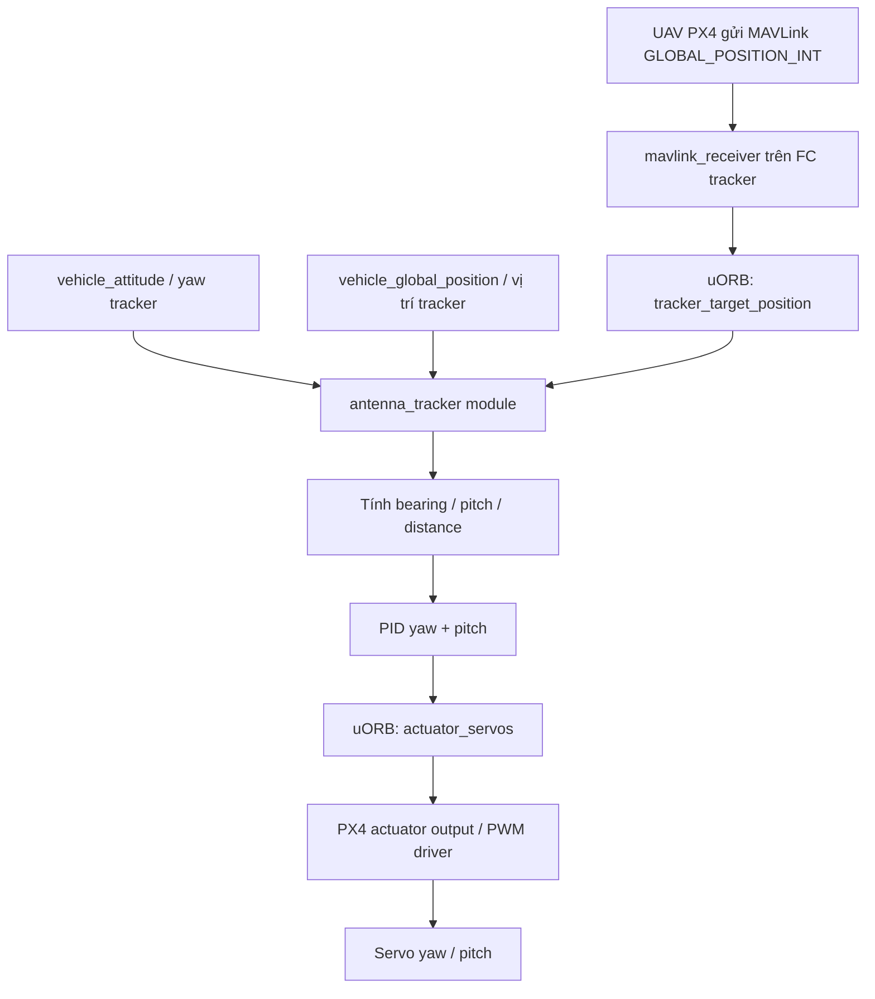

# OVERVIEW.md — PX4 Antenna Tracker Native Firmware

## 1. Mục tiêu dự án

Dự án này hướng tới việc **custom firmware PX4 v1.17.0** để biến một flight controller riêng thành **FC Antenna Tracker**.

FC tracker sẽ:

1. Nhận thông tin vị trí UAV qua MAVLink.
2. Đọc attitude/yaw thực tế của cụm antenna từ AHRS trên chính FC tracker.
3. Tính toán:
   - bearing/yaw target,
   - pitch/elevation target,
   - horizontal distance,
   - trạng thái mất target.
4. Chạy PID yaw/pitch.
5. Xuất lệnh servo yaw/pitch qua pipeline actuator/PWM của PX4.

Hướng này là **PX4-native airframe + PX4-native module**. Mục tiêu là tạo firmware tương tự ArduPilot AntennaTracker nhưng chạy trong kiến trúc PX4.

---

## 2. Phạm vi hiện tại

### In scope

- PX4-Autopilot tag: `v1.17.0`
- Ngôn ngữ chính: C++
- FC tracker chạy firmware PX4 custom
- Tạo airframe mới: `antenna_tracker`
- Tạo module mới: `src/modules/antenna_tracker/`
- Tạo uORB message riêng cho target UAV
- Sửa `mavlink_receiver` để lấy `GLOBAL_POSITION_INT` từ UAV mục tiêu
- Tính toán bearing/pitch/distance
- PID yaw/pitch
- Xuất servo bằng `actuator_servos`
- Test trước bằng SITL/mô phỏng rồi mới test phần cứng

### Out of scope ở giai đoạn đầu

- Không dùng Gimbal v2 làm hướng chính
- Không port toàn bộ ArduPilot AntennaTracker ngay từ đầu
- Không hỗ trợ đầy đủ tất cả mode ngay giai đoạn đầu
- Không làm continuous rotation servo ngay từ đầu nếu chưa cần
- Không tối ưu scan/reacquire target trước khi basic tracking ổn định

---

## 3. Kiến trúc tổng quát



---

## 4. Môi trường phát triển

### Firmware base

```bash
PX4_Autopilot v1.17.0
```

### Target firmware

- PX4 v1.17.0
- Custom branch: `antenna_tracker_v1.17`
- Build target tùy board:
  - SITL build: `make px4_sitl`
  - SITL boot đúng tracker: `PX4_SYS_AUTOSTART=4099 PX4_SIM_MODEL=none ./bin/px4`
  - Hardware ví dụ: `make px4_fmu-v6x_default`
  - Board custom của dự án có thể cần target riêng tùy cấu trúc hiện tại.

Lưu ý: không dùng `make px4_sitl gz_x500` để kiểm tra airframe tracker, vì model `gz_x500` ép `SYS_AUTOSTART=4001` và QGC sẽ hiển thị quadcopter.

---

## 5. Các lớp firmware cần custom

### 5.1 Airframe layer

Thêm file airframe:

```text
ROMFS/px4fmu_common/init.d/airframes/4099_antenna_tracker
```

Nhiệm vụ:

- Khai báo airframe `Generic Antenna Tracker`
- Set `MAV_TYPE` theo antenna tracker nếu PX4 chấp nhận
- Set parameter mặc định cho servo yaw/pitch
- Start MAVLink link để nhận dữ liệu UAV
- Start module `antenna_tracker`

---

### 5.2 Module layer

Thêm module:

```text
src/modules/antenna_tracker/
```

Nhiệm vụ:

- Chạy vòng lặp 50 Hz
- Subscribe:
  - `vehicle_attitude`
  - `vehicle_global_position`
  - `tracker_target_position`
  - parameter update
- Tính toán:
  - target bearing
  - target pitch
  - distance
  - yaw error
  - pitch error
- Chạy PID
- Publish:
  - `actuator_servos`
  - `tracker_status`

---

### 5.3 uORB message layer

Thêm message:

```text
msg/TrackerTargetPosition.msg
msg/TrackerStatus.msg
```

`TrackerTargetPosition` dùng để lưu vị trí UAV mục tiêu nhận từ MAVLink.

`TrackerStatus` dùng để debug/tracking trạng thái module.

---

### 5.4 MAVLink receiver layer

Sửa:

```text
src/modules/mavlink/mavlink_receiver.cpp
src/modules/mavlink/mavlink_receiver.h
```

Nhiệm vụ:

- Bắt message `GLOBAL_POSITION_INT`
- Kiểm tra `sysid` mục tiêu
- Convert dữ liệu:
  - lat/lon giữ dạng `degE7`
  - alt từ `mm`
  - velocity từ `cm/s` sang `m/s`
- Publish ra `tracker_target_position`

---

### 5.5 Actuator/PWM output layer

Không nên tự convert PID trực tiếp sang microsecond PWM trong module ở bản đầu.

Cách đúng theo PX4:

```text
PID output normalized [-1, 1]
    ↓
actuator_servos.control[0/1]
    ↓
PX4 output driver
    ↓
PWM_MAIN/AUX
    ↓
Servo yaw/pitch
```

Module chỉ publish `actuator_servos`. Việc map sang PWM do PX4 output layer xử lý thông qua parameter min/max/center.

---

## 6. Công thức điều hướng chính

### 6.1 Horizontal distance

```math
distance = \sqrt{dlat^2 + dlng_{scaled}^2} \times LOCATION\_SCALING\_FACTOR
```

### 6.2 Bearing

```math
bearing = \frac{\pi}{2} + atan2(-off_y, off_x)
```

Trong đó:

- `off_y` thường tương ứng north offset
- `off_x` thường tương ứng east offset
- Công thức chuyển từ hệ toán học sang hệ la bàn: 0° là North, tăng theo chiều kim đồng hồ.

### 6.3 Pitch/elevation

```math
pitch = atan2(\Delta altitude, distance)
```

Nên dùng `atan2(delta_altitude, distance)` thay vì `atan(delta_altitude / distance)` để an toàn khi distance gần 0.

---

## 7. Quá trình hình thành firmware antenna tracker

Firmware sẽ hình thành theo các lớp sau:

```text
Giai đoạn 1: PX4 module skeleton
Giai đoạn 2: Servo output test bằng actuator_servos
Giai đoạn 3: Geometry + PID với target giả
Giai đoạn 4: Airframe antenna_tracker
Giai đoạn 5: MAVLink target receiver
Giai đoạn 6: SITL/mô phỏng
Giai đoạn 7: Hardware test với servo thật
Giai đoạn 8: Hoàn thiện AUTO/STOP/SCAN/MANUAL nếu cần
```

Triết lý triển khai:

> Làm từng lớp nhỏ, test từng lớp, không sửa MAVLink + uORB + servo + PID cùng lúc.

---

## 8. Kết quả mong muốn bản đầu tiên

Bản firmware đầu tiên được xem là đạt khi:

1. Build PX4 v1.17.0 thành công.
2. Nạp được firmware vào FC tracker.
3. Chọn được airframe `Generic Antenna Tracker`.
4. Module `antenna_tracker` tự start khi boot.
5. Module xuất được PWM điều khiển 2 servo.
6. Module dùng target giả để tự quay yaw/pitch đúng hướng.
7. Sau đó nhận được target thật từ UAV qua MAVLink.
8. Servo yaw/pitch bám theo vị trí UAV trong mô phỏng.

---

## 9. Trạng thái firmware hiện tại, cập nhật 2026-06-07

### 9.1 Luồng dữ liệu đã xác nhận

Firmware hiện chạy theo luồng:

```text
Tracker FC sensors hoặc sensor simulation
IMU / gyro / accel / mag / GPS / baro
        ↓
PX4 estimator
        ↓
vehicle_attitude + vehicle_global_position
        +
Target UAV position từ MAVLink hoặc fake target params
        ↓
antenna_tracker
        ↓
bearing / pitch / yaw error / pitch error
        ↓
PID yaw/pitch
        ↓
actuator_servos.control[0] = yaw
actuator_servos.control[1] = pitch
        ↓
PWM_MAIN_FUNC1=201 -> MAIN1 yaw servo
PWM_MAIN_FUNC2=202 -> MAIN2 pitch servo
```

`antenna_tracker` không đọc raw IMU/mag trực tiếp. Module subscribe dữ liệu đã qua estimator:

```text
vehicle_attitude
vehicle_global_position
tracker_target_position
```

### 9.2 Airframe và output mapping

Airframe hardware:

```text
ROMFS/px4fmu_common/init.d/airframes/4099_antenna_tracker
```

Airframe POSIX/SITL:

```text
ROMFS/px4fmu_common/init.d-posix/airframes/4099_antenna_tracker
```

Các điểm đã chốt:

- `SYS_AUTOSTART=4099`.
- `MAV_TYPE=5`, tương ứng Antenna Tracker.
- `VEHICLE_TYPE=antenna_tracker` để không kéo multicopter/fixed-wing/rover controllers không cần thiết.
- `PWM_MAIN_FUNC1=201`, tương ứng `Servo1`, yaw.
- `PWM_MAIN_FUNC2=202`, tương ứng `Servo2`, pitch.
- POSIX SITL bật `SENS_EN_GPSSIM=1`, `SENS_EN_BAROSIM=1`, `SENS_EN_MAGSIM=1` để có dữ liệu estimator mô phỏng.

QGC metadata dùng:

```text
@type Antenna Tracker
@class Rover
```

`@type Antenna Tracker` tạo group UI riêng. `@class Rover` chỉ để QGC chấp nhận metadata airframe; firmware behavior vẫn là tracker nhờ `MAV_TYPE=5` và `antenna_tracker start`.

### 9.3 Kết quả SITL đã xác nhận

Lệnh boot tracker SITL:

```bash
cd build/px4_sitl_default
PX4_SYS_AUTOSTART=4099 PX4_SIM_MODEL=none ./bin/px4
```

Đã xác nhận:

```text
SYS_AUTOSTART = 4099
MAV_TYPE = 5
SENS_EN_GPSSIM = 1
SENS_EN_BAROSIM = 1
SENS_EN_MAGSIM = 1
vehicle_attitude published
vehicle_global_position lat/lon/alt valid
antenna_tracker running
actuator_servos published
```

Dòng `No autostart ID found` đã được xử lý bằng cách set `VEHICLE_TYPE=antenna_tracker`.

### 9.4 Checklist debug cho lần update tiếp theo

Khi có lỗi mới, kiểm tra theo thứ tự:

```sh
param show SYS_AUTOSTART
param show MAV_TYPE
param show PWM_MAIN_FUNC1
param show PWM_MAIN_FUNC2
param show TRK_MODE
param show TRK_SERVO_TEST
antenna_tracker status
listener vehicle_attitude
listener vehicle_global_position
listener tracker_target_position
listener tracker_status
listener actuator_servos
listener actuator_outputs
```

Diễn giải nhanh:

- Nếu `vehicle_attitude` không publish: lỗi sensor/estimator attitude.
- Nếu `vehicle_global_position` không publish hoặc lat/lon invalid: dùng GPS ngoài trời hoặc bật `TRK_HOME_EN` với `TRK_HOME_LAT/LON/ALT` để bench test.
- Nếu `tracker_target_position` không publish khi có UAV target: lỗi MAVLink receiver/sysid/target link.
- Nếu `tracker_status.target_valid=False`: tracker chưa có target hợp lệ hoặc bị timeout.
- Nếu `actuator_servos` đúng nhưng `actuator_outputs` không đổi: kiểm tra arming/disarmed state và `PWM_MAIN_FUNC1/2`.
- Nếu QGC báo `MAV_TYPE Unknown:5`: đây là giới hạn UI, giá trị `5` vẫn đúng cho antenna tracker.

### 9.5 Checklist hardware Pixhawk 6C

Khi nạp firmware vào Pixhawk 6C hoặc board thật:

1. Calibrate accelerometer.
2. Calibrate gyroscope.
3. Calibrate compass/magnetometer.
4. Calibrate level horizon.
5. Kiểm tra GPS fix và `vehicle_global_position`.
6. Kiểm tra power module nếu dùng.
7. Kiểm tra yaw servo trên MAIN1 và pitch servo trên MAIN2.
8. Kiểm tra chiều servo, center, min/max trước khi bật tracking thật.

Compass/yaw là rủi ro lớn nhất: nếu heading sai thì antenna sẽ quay sai hướng dù target position đúng.
