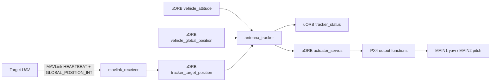

# Antenna Tracker Architecture

## Current PX4-native data flow



The current module runs at 50 Hz. It consumes tracker attitude, tracker global position, parameter updates, target position, vehicle status, and manual-control input. It publishes `tracker_status` and `actuator_servos`.

## Output ownership

The tracker uses the normal PX4 actuator pipeline:

```text
normalized command [-1, 1]
  -> actuator_servos.control[0 or 1]
  -> OutputFunction Servo1 / Servo2
  -> PWM driver min/max/disarmed/failsafe configuration
  -> servo
```

The hardware airframe assigns:

| Physical output | PX4 function | Tracker axis |
|---|---:|---|
| MAIN1 | `201` / Servo 1 | yaw |
| MAIN2 | `202` / Servo 2 | pitch |

The tracking module must not produce raw PWM microseconds. The PWM driver remains responsible for PWM conversion, reversal, and output constraints.

## Positional-servo architecture

The intended runtime structure is:

```text
Target source
  -> target validity, source filtering, timeout, optional prediction
  -> geometry: desired world yaw/pitch
  -> mechanical planner: reachable sector, cable-wrap policy, pitch limits, park policy
  -> servo mapper: desired physical angle -> normalized Servo1/Servo2 position
  -> small closed-loop correction and slew limiter
  -> actuator_servos
```

All operating modes must use this same angle-domain path:

| Tracker mode | Planner output |
|---|---|
| STOP | configured yaw/pitch park angles |
| AUTO | bearing/elevation setpoints from target geometry |
| SCAN | bounded scan angle trajectory |
| MANUAL | angle or rate setpoint derived from manual input |
| SERVO_TEST | limited bench-only motion |

## Target source contract

`tracker_target_position` is published from MAVLink `GLOBAL_POSITION_INT` only when the local vehicle is `MAV_TYPE_ANTENNA_TRACKER` and the source has a fresh qualifying `HEARTBEAT` from the same system/component pair. The production bridge accepts `MAV_COMP_ID_AUTOPILOT1`, rejects self and GCS sources, then applies configured system-ID selection or validated auto-lock. Auto-lock remains bound to the accepted system/component until no accepted position update arrives within `TRK_TIMEOUT_MS`.

The topic appends source component, MAVLink instance, receipt age, heartbeat/type, position, altitude, and velocity validity metadata. `target_age_ms` is zero when the receiver publishes an accepted update; consumers derive its live age from `last_update_us` using the local PX4 clock. Unknown velocity is stored as zero with `velocity_valid=false`, so it cannot drive prediction.

Production altitude computation uses the absolute MSL altitude. `relative_alt` belongs to the target vehicle's home reference and must not be treated as a height difference to the tracker unless the system proves both homes share a reference.

## Source decomposition

| Component | Responsibility |
|---|---|
| `antenna_tracker_main.cpp/.hpp` | PX4 module lifecycle, subscriptions, publications, state transitions |
| `tracker_target_manager.*` | target source selection, validity, timeout, filtering, prediction |
| `tracker_setpoint_planner.*` | geometry, park/scan/manual setpoints, yaw sector handling |
| `tracker_axis_controller.*` | stateful positional-servo command and bounded correction |
| `tracker_servo_mapper.*` | mechanical angles, output range, trim, reverse, mapping |
| `tracker_events.*` | edge-triggered PX4 Events for operator-visible state changes |

Where available, use PX4 utilities rather than duplicate them:

- geographic helpers in `src/lib/geo/geo.h`;
- angle wrapping in Matrix helpers;
- slew-rate helpers in `src/lib/slew_rate/`;
- the established `actuator_servos`/Servo output-function pipeline.

## Mechanical model

This project targets **positional yaw and pitch servos with moving IMU feedback**. The future parameter model must describe real mechanics, not only normalized output:

- yaw minimum, maximum, and park angle;
- pitch minimum, maximum, and park angle;
- servo direction/reversal;
- calibrated angle-to-normalized mapping;
- yaw reachable sector and cable-wrap restrictions.

A symmetric `TRK_YAW_RANGE` alone is not enough to express an offset sector or cable-management limit. No target angle should be commanded through a mechanical stop merely because it is the shortest wrapped heading.

## Safety boundaries

- A target timeout, invalid sensor, STOP request, or startup state must produce a configured **park** command, not an assumed-safe hard-coded normalized zero.
- SCAN is opt-in. It is never the default loss-of-target action until its mechanical sector is validated.
- Dead reckoning is optional and should remain disabled by default until validated with real target telemetry.
- No other flight controller or allocator may publish competing values to `actuator_servos` in the dedicated tracker target.
